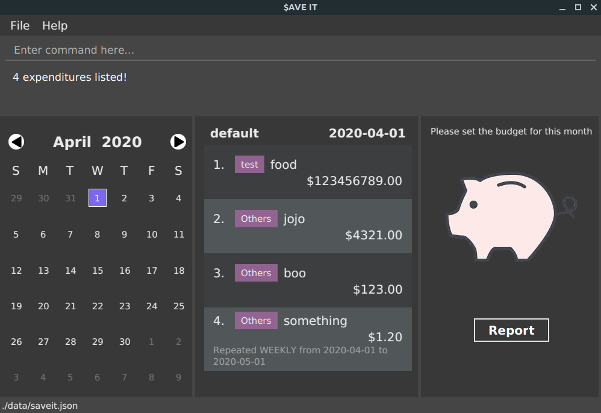

= $aveIt
ifdef::env-github,env-browser[:relfileprefix: docs/]

https://travis-ci.org/AY1920S2-CS2103T-T10-3/main[image:https://travis-ci.org/AY1920S2-CS2103T-T10-3/main.svg?branch=master[Build Status]]
https://ci.appveyor.com/project/zwasd/main[image:https://ci.appveyor.com/api/projects/status/2h52s7lj155mavgc?svg=true[Build status]]
https://coveralls.io/github/AY1920S2-CS2103T-T10-3/main?branch=master[image:https://coveralls.io/repos/github/AY1920S2-CS2103T-T10-3/main/badge.svg?branch=master[Coverage Status]]

ifdef::env-github[]

endif::[]

ifndef::env-github[]
image::images/Ui.png[width="600"]
endif::[]

* This is a desktop budget management application. It has a GUI but most of the user interactions happen using a CLI (Command Line Interface).
* The application is aimed towards tertiary students who likes to type a lot.
* As tertiary students are at a stage without a fixed income, they can use this to manage their spendings.

== Site Map

* <<UserGuide#, User Guide>>
* <<DeveloperGuide#, Developer Guide>>
* <<LearningOutcomes#, Learning Outcomes>>
* <<AboutUs#, About Us>>
* <<ContactUs#, Contact Us>>

== Acknowledgements

* Some parts of this sample application were inspired by the excellent http://code.makery.ch/library/javafx-8-tutorial/[Java FX tutorial] by
_Marco Jakob_.
* Libraries used: https://openjfx.io/[JavaFX], https://github.com/FasterXML/jackson[Jackson], https://github.com/junit-team/junit5[JUnit5]

== Licence : link:LICENSE[MIT]
